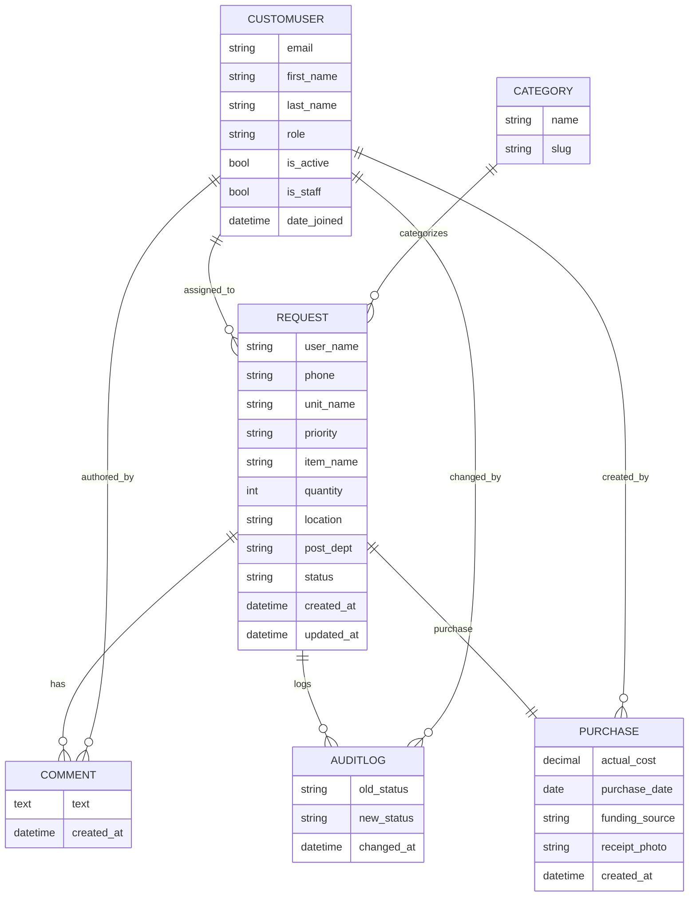
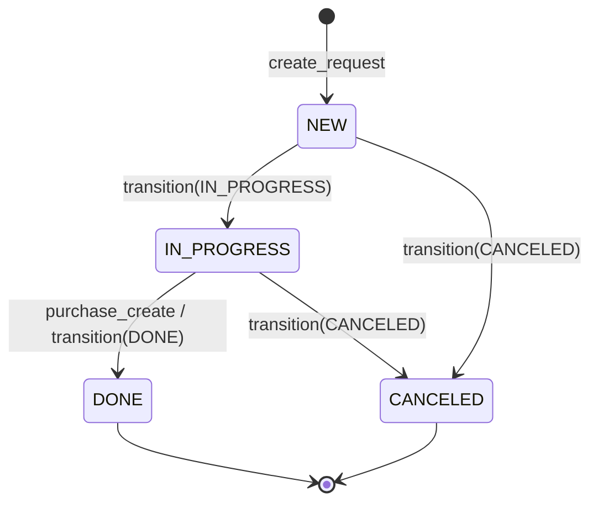
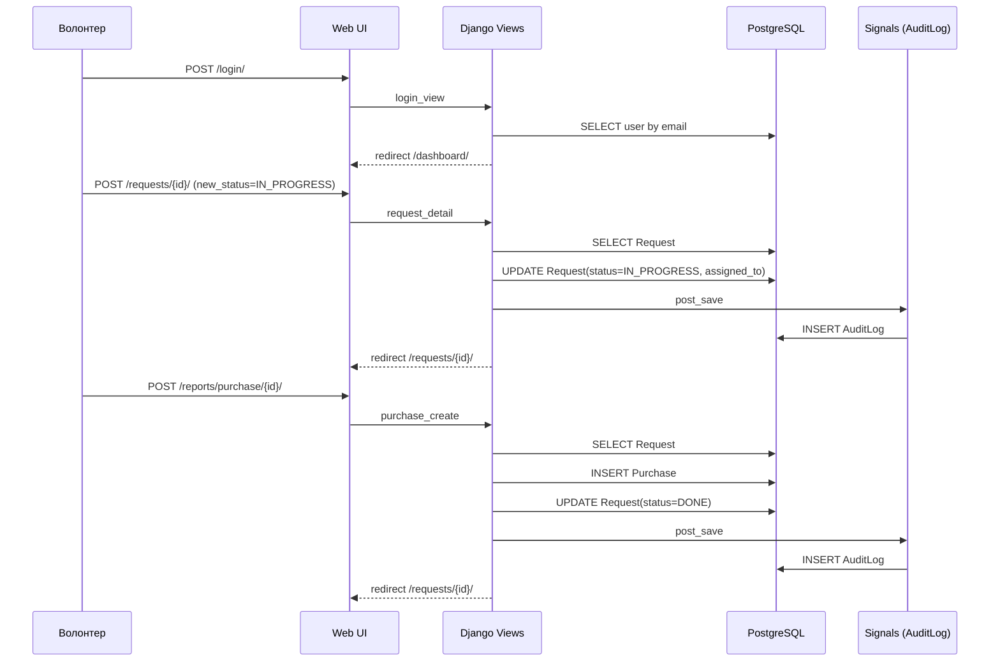

# Інформаційна система збору та оброблення заявок від військових на матеріальну допомогу (БФ «Сила Єдності»)

## 1. Вступ та Призначення Системи (Introduction & Purpose)
Цей програмний продукт створено для впорядкування процесу приймання, оброблення та контролю заявок на матеріальну допомогу від військових підрозділів. У домені волонтерської логістики характерною є фрагментація каналів комунікації (месенджери, електронна пошта, усні звернення), що породжує втрату контексту, дублювання даних та відсутність прозорого статусу виконання. Запропонована система усуває ці ризики шляхом централізованої веб-платформи, де кожна заявка існує як формалізована сутність зі станом, історією переходів та повним контекстом виконання.

Рішення реалізоване як монолітна Django-система з чітко відокремленими рівнями представлення, прикладної логіки та зберігання даних. Така архітектурна організація дозволяє забезпечити керованість процесів (workflow), відтворюваність дій волонтерів та системну звітність для керівництва. Важливо, що життєвий цикл заявки завершується фіксацією закупівлі та можливістю формування зведених Excel-звітів у довільному діапазоні дат.

## 2. Глибокий Аналіз Архітектури (Deep Architectural Analysis)
Система побудована за трирівневою клієнт-серверною архітектурою, де кожен рівень має чітко визначену функціональну відповідальність і відповідає принципам розділення відповідальностей (Separation of Concerns). Рівень представлення формується HTML-шаблонами з Bootstrap 5 і забезпечує адаптивний інтерфейс для різних груп користувачів. Рівень прикладної логіки реалізовано в Django views та сервісних модулях, де зосереджені правила переходу статусів, фільтрації та перевірок. Рівень даних представлений PostgreSQL, а взаємодія з ним здійснюється через ORM, що дозволяє оперувати доменними моделями без прямого написання SQL.

На практиці це означає, що HTTP-запит спочатку проходить middleware (зокрема аутентифікацію та CSRF-захист), далі диспетчеризація виконується через URL-конфігурації, а основне рішення приймається у view-функціях. View формує контекст, підключає шаблон і повертає сформовану HTML-відповідь або файл (Excel-звіт). Таким чином, контролюється як UX, так і консистентність даних.

### DIAGRAM 1 — Архітектурна схема
```mermaid
graph TD
  U1[Військовий] -->|HTTP| UI[Веб-інтерфейс (HTML/Bootstrap)]
  U2[Волонтер] -->|HTTP| UI
  U3[Директор] -->|HTTP| UI

  UI --> APP[Django App (Views + Services)]
  APP -->|ORM| DB[(PostgreSQL)]
  APP --> MEDIA[/Media storage: /media/]
  APP --> XLSX[Excel Export (openpyxl)]

  APP --> AUTH[Auth Middleware + Sessions]
  APP --> TEMPL[Templates Engine]
```

## 3. Проєктування Бази Даних (Database Design & ORM)
Модель даних розроблена відповідно до прикладної логіки та формалізує ключові бізнес-об’єкти: користувачів, заявки, категорії, внутрішні нотатки, аудити та закупівлі. Використання Django ORM дає змогу описати схему через класи моделей, де визначені типи полів, зв’язки та обмеження цілісності. Наприклад, `Request` містить `ForeignKey` до `Category` і `assigned_to`, що моделює належність заявки до категорії та прив’язку до волонтера; `Purchase` має `OneToOneField` до `Request`, що забезпечує строгий зв’язок «одна заявка — одна закупівля».

Значущою частиною є аудит: у `apps/applications/signals.py` застосовано сигнали `pre_save` та `post_save`, що автоматично фіксують переходи статусів у `AuditLog`. Це дозволяє зберігати історію змін без дублювання логіки в кожному view та забезпечує трасування дій користувача. Також на рівні доменної моделі встановлено стани заявок (`NEW`, `IN_PROGRESS`, `DONE`, `CANCELED`), які служать базою для бізнес-логіки переходів у `StatusService`.

### DIAGRAM 2 — ER-діаграма


## 4. Життєвий цикл заявки та Бізнес-логіка (Request Lifecycle & Business Logic)
Логіка статусів реалізована через `StatusService`, який є централізованим механізмом контролю переходів. Поточні стани зафіксовані в `Request.Status`, а допустимі переходи визначаються таблицею `ALLOWED_TRANSITIONS`. Перехід до статусу `IN_PROGRESS` автоматично фіксує відповідального волонтера (`assigned_to`), що унеможливлює «безхазяйні» заявки та забезпечує трасування відповідальних осіб. Під час переходу до `DONE` система також гарантує наявність відповідального навіть у випадку, якщо раніше він не був визначений.

Валідація ключових даних здійснюється на рівні форм і сервісів: `RequestValidator` вимагає формат телефону `+380XXXXXXXXX`, що гарантує структурованість даних для подальшої аналітики та контактів.

### DIAGRAM 3 — Діаграма станів заявки


## 5. Взаємодія Компонентів (Component Interaction)
Найбільш складним сценарієм є оброблення заявки волонтером із подальшим внесенням даних закупівлі. Послідовність включає авторизацію, зміну статусу заявки, додавання `Purchase` та автоматичний перехід заявки у стан `DONE`. На рівні ORM це відповідає серії `SELECT` для завантаження заявки, `UPDATE` для встановлення статусу та `INSERT` для створення запису закупівлі. Паралельно працюють сигнали, які формують запис у `AuditLog` для аудиту змін.

### DIAGRAM 4 — Sequence-діаграма


## 6. Механізми Безпеки та Авторизації (Security & Authentication Mechanisms)
Безпекова модель реалізована на базі стандартних механізмів Django. Аутентифікація використовує вбудовані алгоритми хешування паролів Django (PBKDF2 із сольовими значеннями), що забезпечує стійкість до атаки методом підбору. Сесійна аутентифікація підтримується middleware `AuthenticationMiddleware` і є основою для перевірок `@login_required` у view-функціях.

Доступ на рівні ролей реалізовано через кастомну модель користувача `CustomUser` з ролями `VOLUNTEER` та `DIRECTOR`. Для обмеження критичних операцій (управління волонтерами) застосовано декоратор `director_required`, що блокує доступ неавторизованим або неуповноваженим користувачам. Захист від CSRF-атак активовано глобально в `CsrfViewMiddleware` і підтверджується використанням `` у шаблонах форм.

## 7. Інтерфейс Користувача та UX (User Interface & UX Strategy)
Інтерфейс реалізовано як HTML-шаблони на Bootstrap 5 з орієнтацією на швидке завантаження і читабельність на мобільних пристроях. Для військових важлива мінімальна когнітивна складність: форма заявки коротка, з чіткими підказками та валідацією. Для волонтерів ключовим є інформаційна щільність: дашборд містить таблиці, фільтри, індикатори статусів і швидкі дії з переходом до деталей. Додатково інтерфейс містить системні повідомлення (flash-меседжі) та блокування дій, якщо заявка вже обробляється іншим волонтером.

## 8. Деталізована Структура Репозиторію (Detailed Repository Structure)

```
syla-yednosti/
├── apps/
│   ├── accounts/            # модель користувача, авторизація, управління волонтерами
│   ├── applications/        # заявки, статуси, фільтрація, аудит, коментарі
│   └── reports/             # закупівлі, Excel-звіти
├── config/                  # конфігурації Django (base/local/production)
├── templates/               # HTML-шаблони та частини UI
├── static/                  # CSS/JS/зображення
├── media/                   # завантажені файли чеків
├── requirements/            # залежності (base/local/production)
├── docker-compose.yml       # локальний запуск з PostgreSQL
├── Dockerfile               # опис контейнера Django
├── manage.py
└── Makefile                 # сценарії запуску
```

Каталог `apps/accounts` містить кастомну модель користувача, форми входу та модуль управління волонтерами, що реалізує базові CRUD-операції для директора. `apps/applications` є ядром домену: тут описано модель заявок, механізми переходів статусів і логіку аудиту. `apps/reports` містить модель закупівель і сервіс генерації Excel, який формує звіт на основі фактичних закупівель.

## 9. Інструкція з Розгортання (Deployment & Environment Configuration)

### Локальне розгортання через Docker Compose

```bash
cp .env.example .env
# за потреби змініть значення змінних

docker compose up --build
```

### Локальне розгортання через venv

```bash
python -m venv venv
source venv/bin/activate
pip install -r requirements/base.txt

python manage.py migrate
python manage.py createsuperuser
python manage.py runserver
```

### Змінні середовища
Конфігурація керується через `.env` і зчитується за допомогою `python-decouple`. Мінімально необхідні змінні: `DJANGO_SECRET_KEY`, `DJANGO_DEBUG`, `DJANGO_ALLOWED_HOSTS`, `DB_NAME`, `DB_USER`, `DB_PASSWORD`, `DB_HOST`, `DB_PORT`, `DJANGO_SETTINGS_MODULE`.

## 10. Автор
**Розробник:** Слободянюк Олексій Вікторович
